#  Onde Frontend

Onde 웹 서비스의 최적화된 웹 애플리케이션 프론트엔드 저장소입니다.  
본 프로젝트는 **고객용 포탈 서비스**와 **비즈니스용 백오피스(판매자/어드민)** 서비스를 통합 제공하며, 실제 운영 환경(AWS 등)에서의 무중단 서빙 및 보안 아키텍처(Nginx 리버스 프록시)를 지원합니다.

<p align="center">
  
  
  
  
  
  
</p>

<!-- 👥 Onde 캐릭터 여정 시작 웰컴 배너 -->
<p align="center">
  
</p>

---

## 🖥️ 주요 페이지 구성 및 기능 소개 (Pages & Flows)

각 서비스 페이지의 상세 기능과 UI 흐름을 소개합니다.

### 1. 숙소 예약 페이지 (Stay Page)
* **경로**: `/` (기본 홈 경로)
* **주요 기능**:
  * **숙소 상품 큐레이션**: 성수기/비성수기 필터링 및 카테고리별(호텔, 펜션, 게스트하우스 등) 맞춤 목록 서빙.
  * **상세 정보 및 객실 토글**: 숙소의 세부 소개글 및 등록된 개별 객실의 정원, 가격 상세 정보를 리스트로 조회.
  * **일정 지정 및 실시간 요금 계산**: 투숙일정(체크인/체크아웃)을 달력으로 지정하면 성수기 기간 매핑 및 숙박 일수를 자동으로 연산하여 객실별 최종 합산 요금을 실시간 동적 표시.
  * **예약 흐름 진입**: 원하는 객실과 투숙 인원을 지정해 결제 단계로 즉시 넘겨주는 핵심 홈 페이지.

  <p align="center">
    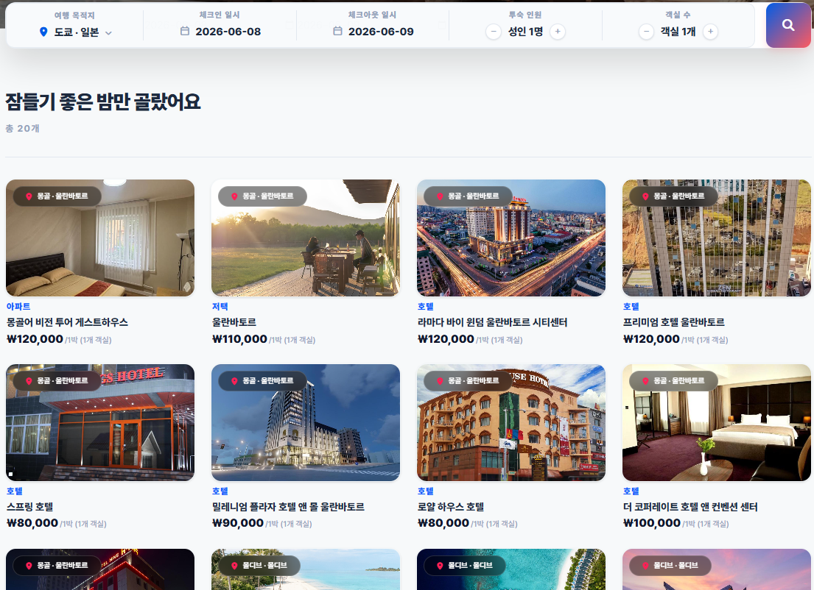
  </p>

---

### 2. 항공권 예약 페이지 (Flight Page)
* **경로**: `/flight`
* **주요 기능**:
  * **다양한 노선 조회**: 출발지/도착지 공항, 일자, 탑승 인원 설정을 통한 노선 실시간 필터 조회.
  * **편도/왕복 설정**: 여정에 따라 편도 및 왕복 노선을 번갈아 선택하고 통합 예약 번호를 부여받는 기능.

  <p align="center">
    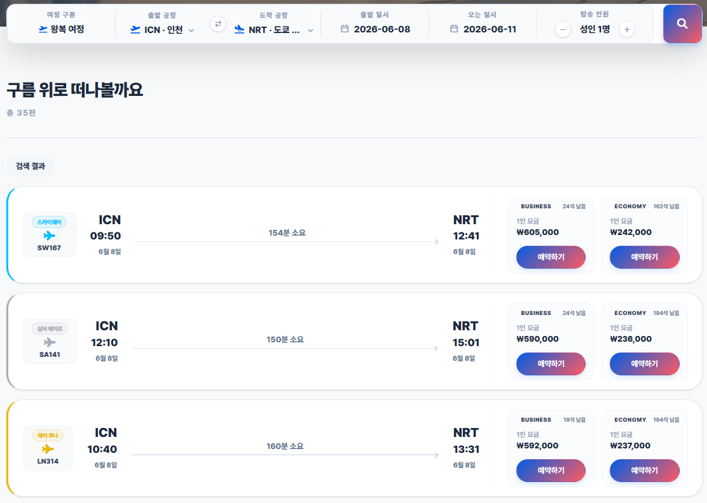
  </p>

---

### 3. 렌터카 탐색 페이지 (Car Page)
* **경로**: `/car`
* **주요 기능**:
  * **차종 필터 및 정렬**: 경형/소형/준중형/SUV/대형 등 분류별 검색 및 하루 기본 렌트비 순 정렬 기능.
  * **차량 상세 제원 확인**: 차량 연식, 유종, 인수 위치 정보를 명시하여 오예약 방지.
  * **대여 일정 설정 및 요금 자동 계산**: 대여일시와 반납일시(픽업/반납 날짜 및 시간)를 선택하면 일 단위 기본 렌트 단가에 이용 기간을 실시간으로 곱하여 최종 총 결제 대금을 화면에 동적 노출 및 홀드(Hold) 예약 생성.

  <p align="center">
    
  </p>

---

### 4. 여행자 보험 안내 페이지 (Insurance Page)
* **경로**: `/insurance`
* **주요 기능**:
  * **여행 상품 연계 보험**: 여행 일정 중 발생할 수 있는 사고에 대비하기 위한 단기 여행자 보험 상품 정보 소개 및 신청 안내.

  <p align="center">
    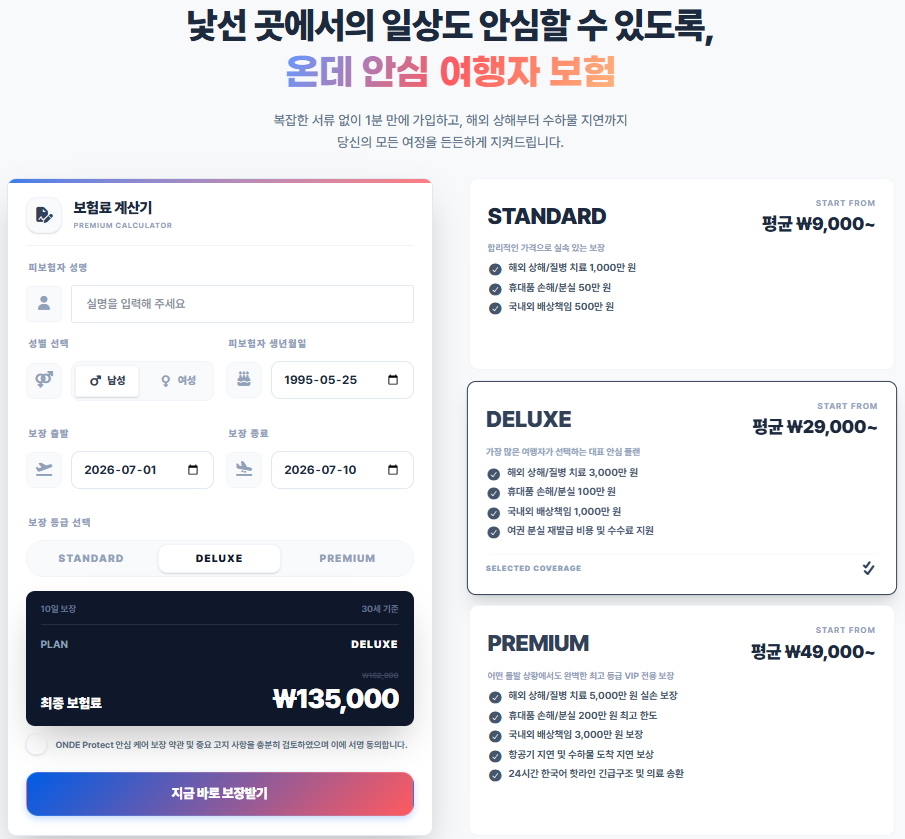
  </p>

---

### 5. 지도 기반 통합 탐색 페이지 (Map Search Page)
* **경로**: `/map`
* **주요 기능**:
  * **Leaflet 인터랙티브 지도**: 마커를 활용한 실시간 숙박 업소 위치 맵핑 및 드래그/확대 시 필터링 동기화.
  * **위경도 바운즈(Bounds) 탐색**: 지도 영역 및 일정 조건에 걸리는 자산 검색 및 스케일 자동 flyTo 리포커스.
  * **퀵 프리뷰**: 지도 위의 특정 마커 클릭 시 간편 요약 팝업을 띄우고 디테일 상세 페이지로 라우팅 연계.

  <p align="center">
    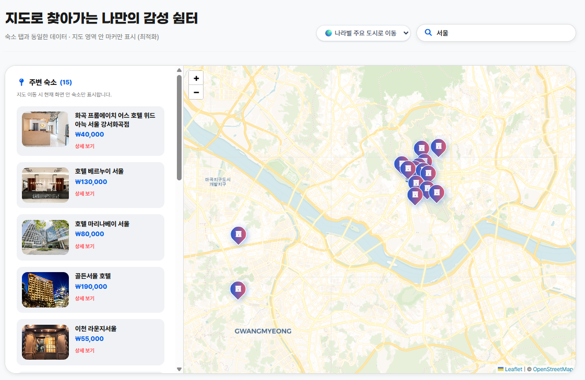
  </p>

---

### 6. 여행기 (포토 다이어리 & 여행 피드) (Feed Page)
* **경로**: `/feed`
* **주요 기능**:
  * **소셜 타임라인**: 유저들이 본인의 숙박 및 여행 경험을 포토 후기로 남기는 인스타그램 스타일의 카드형 피드.
  * **리치 미디어 업로드**: MinIO 오브젝트 스토리지와 연계하여 드래그앤드롭 이미지 업로드 및 후기 쓰기 기능 지원.

  <p align="center">
    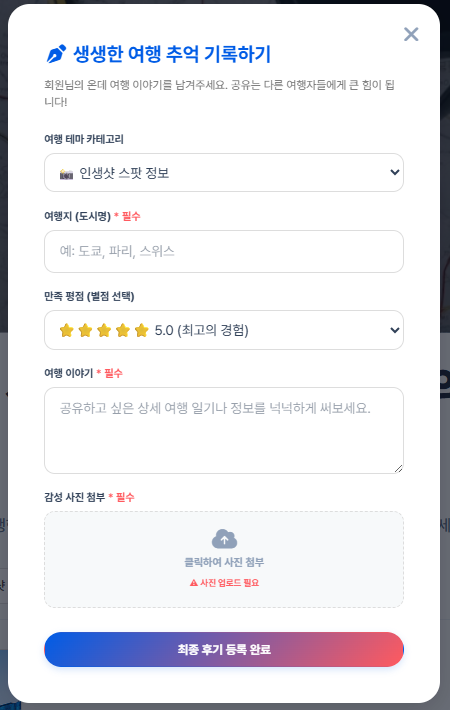
    
  </p>

---

### 7. 판매자 백오피스 (Seller Page)
* **경로**: `/seller` (판매자 등급 전용 가드)
* **주요 기능**:
  * **동적 숙소/객실 등록**: 객실 크기, 침대 타입, 기준 인원 등을 실시간 폼 배열에 동적으로 추가하여 신청.
  * **렌터카 자산 등록**: 렌터카 차량 모델 및 요금 정보를 백엔드 승인 큐에 등록.

  <p align="center">
    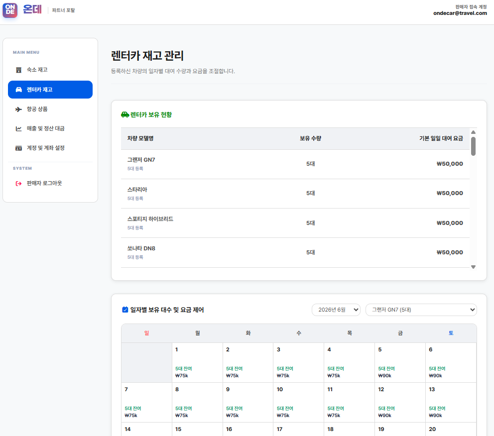
  </p>

---

### 8. 관리자 대시보드 (Admin Page)
* **경로**: `/admin` (최고 관리자 전용 가드)
* **주요 기능**:
  * **승인 프로세스 관리**: 판매자가 신규 신청한 숙박/렌터카 자산에 대한 상세 검증 및 승인/반려 제어.
  * **종합 통계 및 정산**: 누적 예약 수, 일간 결제 지표 등 핵심 비즈니스 KPI 대시보드 및 파트너 정산 기능.

  <p align="center">
    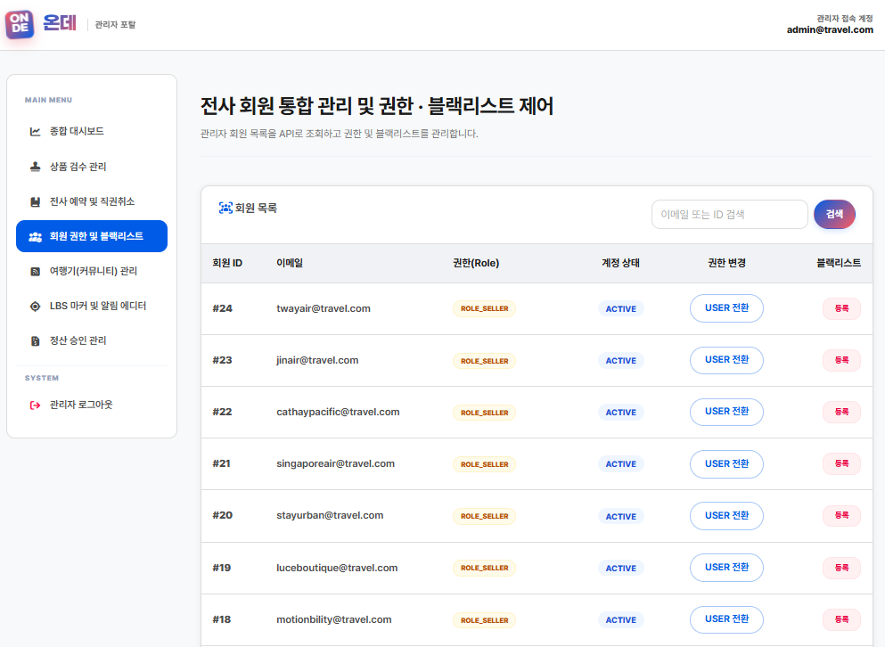
  </p>

---

### 9. 결제 및 검증 페이지 (Payment & Callback Page)
* **경로**: `/payment`, `/payment/callback`
* **주요 기능**:
  * **ONDE 가상 지갑(Wallet) 결제**: 외주 PG 모듈 대신 서비스 가입 시 지급되거나 충전 가능한 ONDE 내부 가상 지갑 잔액을 실시간으로 차감하여 차별화된 인클라우드 안전 결제 처리.
  * **마일리지 할인 및 사전 검증**: 사용자가 입력한 마일리지 차감액을 즉시 반영하여 최종 결제액을 연산하고, 백엔드 지갑 DB 트랜잭션과 검증 단계를 연동해 고정성 있는 무결성 결제 승인 완료.

  <p align="center">
    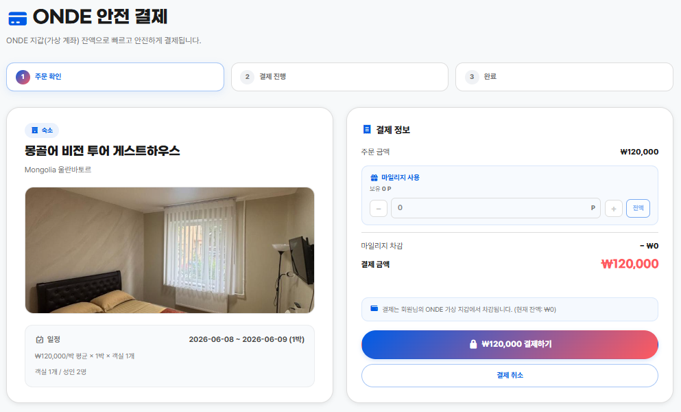
  </p>

---

### 10. 마이페이지 (My Page)
* **경로**: `/mypage`
* **주요 기능**:
  * **예약 통합 타임라인**: 항공, 숙소, 렌터카 예약 내역 및 실시간 예약 상태(`PENDING`, `CONFIRMED`, `CANCELLED`) 추적.
  * **회원 정보 편집**: 프로필 변경 및 비밀번호 재설정 기능.

  <p align="center">
    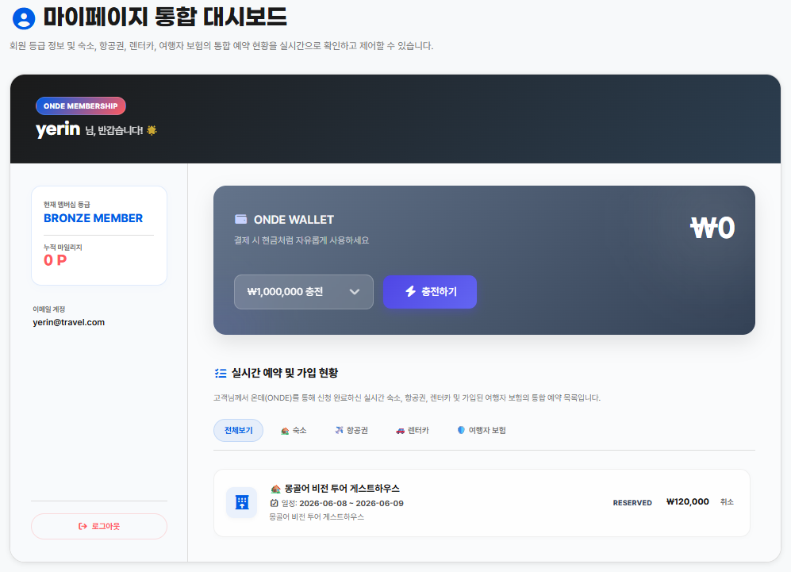
  </p>

---

### 11. 통합 예외 대응 및 권한 제어 (Error Page)
* **경로**: `/error` (401, 403, 404, 500 대응)
* **주요 기능**:
  * **UX 친화적 안내**: 에러 종류에 맞는 전용 일러스트와 원인 메시지를 출력하여 안전하게 홈으로 복귀 유도.

  <p align="center">
    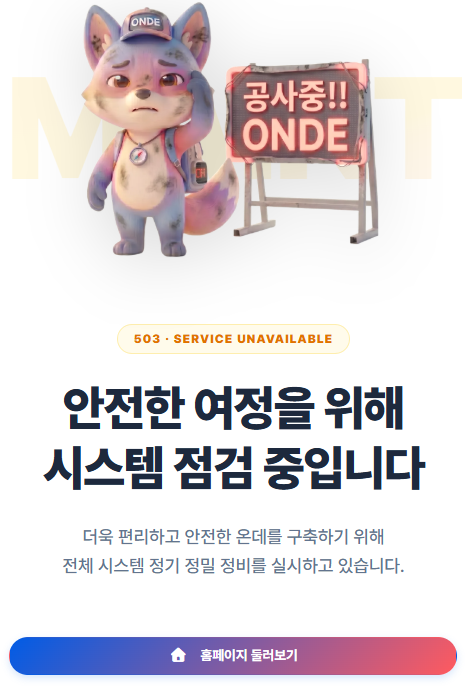
    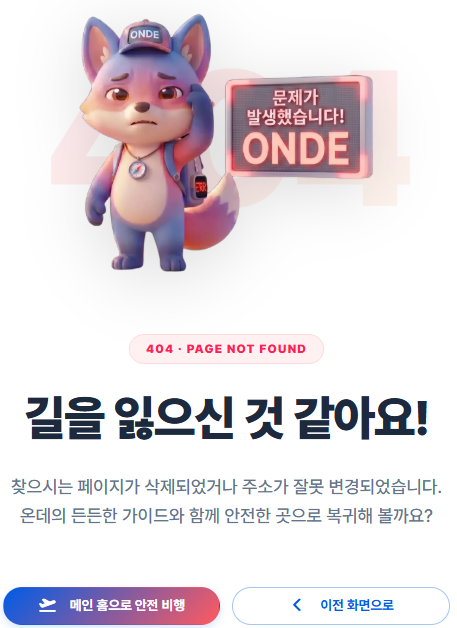
    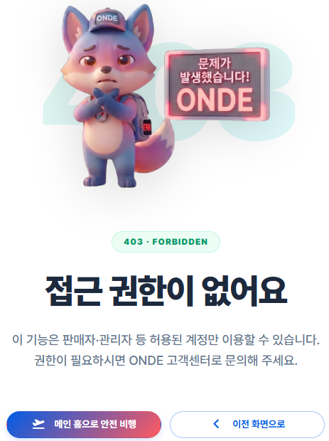
    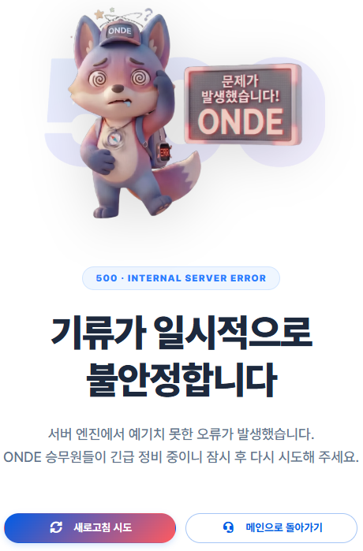
  </p>

---

### 12. 공통 헤더 및 인증 모달 (Header & Auth Modal)
* **경로**: 모든 페이지 공통 (헤더 영역 및 로그인/회원가입 클릭 시 레이어 팝업)
* **주요 기능**:
  * **반응형 네비게이션 헤더**: 인증 상태(로그인/로그아웃) 및 역할(일반 사용자, 판매자, 관리자)에 맞춘 메뉴 및 마이페이지 동적 노출.
  * **통합 인증 모달 (AuthModal)**: 미려한 글라스모피즘 스타일 백드롭 하에 로그인(`LoginForm`) 및 회원가입(`SignupForm`) 모달을 부드러운 애니메이션 전환으로 일괄 제공.

  <p align="center">
    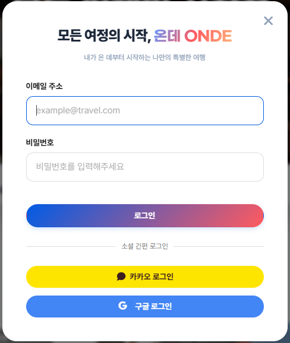
    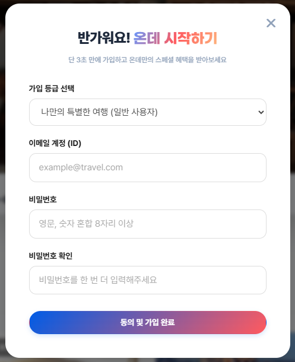
  </p>

---

### 🎁 회원가입 웰컴 팝업 (Signup Welcome Popups)
가입 대상자의 역할(Role)에 맞춰 노출되는 맞춤형 환영 팝업 모달입니다.
* **일반 사용자 가입 환영 팝업 (WelcomeModal)**: 일반 유저(`cust`) 회원가입이 성공하면, 온데와 함께하는 프리미엄 여정의 시작을 축하하는 감성 팝업 UI입니다.
* **판매자 승인 대기 안내 팝업 (SellerPendingModal)**: 비즈니스용 판매자(`sell`) 가입 시 관리자 승인 대기 상태(`PENDING`)임을 명확히 인지시키는 보안 안내 팝업 UI입니다.

  <p align="center">
    
    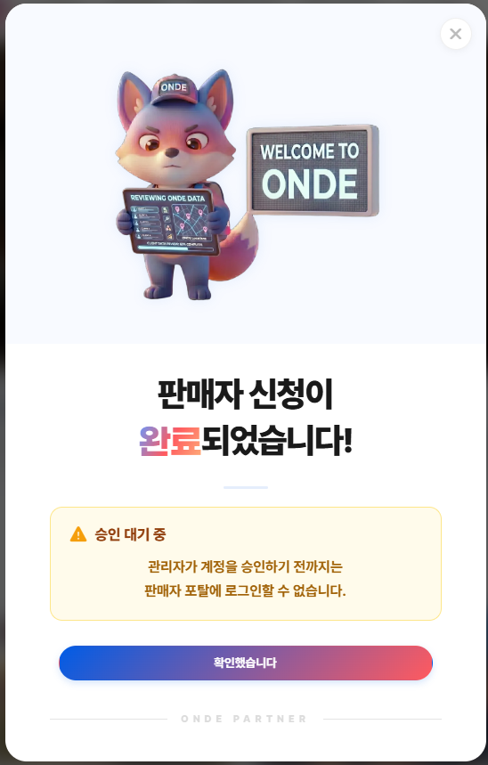
  </p>

---

## 🏗️ 핵심 아키텍처 설계 (Key Architectural Highlights)

* **쿠키 연동 인증 상태 유지 (Cookie-based Auth)**: 서비스 진입 시 브라우저 쿠키의 로그인 세션 정보를 Zustand 전역 스토어에 즉시 바인딩하여 화면 깜빡임 없이 세션을 복구합니다.
* **401 JWT 재발급 중복 방지 (Token Refresh Mutex)**: Access Token 만료 시 다수의 API 요청이 동시에 실패하더라도, 재발급 API 요청을 단 1회만 보낸 뒤 대기열 큐(`refreshWaiters`)를 통해 재발급 완료 시 일괄 재요청을 수행합니다.
* **라우팅 권한 통제 및 포털 레이아웃 (Guards & Portal)**: 페이지 이동 시 등급별 권한 검증 및 강제 리다이렉션을 처리하며, 전역 모달과 토스트가 부모 z-index 영향을 받지 않도록 React Portal을 사용해 분리 렌더링합니다.
* **지도 범위 기반 상품 필터링 (Leaflet Map)**: 사용자의 현재 지도 화면 영역(Bounds) 좌표를 백엔드 API와 연동해 범위 내의 등록 상품만 필터링하여 노출하고 마커 중심으로 맵을 이동시킵니다.
* **Nginx 리버스 프록시 (Reverse Proxy)**: 로컬 및 운영 배포 환경에서 API 통신 경로를 상대 경로(`/user-api`, `/admin-api`)로 단일화하여 브라우저 CORS 이슈를 방지하고 프론트엔드 포트만 공개하도록 인프라를 격리합니다.
* **가상 지갑 결제 검증 (ONDE Wallet)**: 가상 지갑 잔액 차감 결제 방식을 지원하며, 주문 전 사전 검증(`prepare_payment_api`) 및 사후 검증(`validate_payment_api`) API를 호출해 결제 데이터 정합성을 확인합니다.

---

## 📂 디렉토리 구조 (Directory Structure)

```text
Onde_Frontend/
├── src/
│   ├── api/          # Axios Instance 및 인터셉터, 도메인별 API 연동부
│   ├── assets/       # 로컬 정적 자원 (Font, Image, readme 이미지)
│   ├── components/   # 재사용 가능한 UI 컴포넌트
│   │   ├── auth/     # 로그인 및 회원가입 모달 UI 폼
│   │   ├── layout/   # MainLayout(고객용), BackOfficeLayout(어드민/판매자용)
│   │   ├── routing/  # RequireAuth, RequireRole 가드 및 포털 셸
│   │   └── ui/       # Toast, Confirm 등 공통 플로팅 컴포넌트
│   ├── constants/    # 공통 상수, API 경로 설정, 정적 데이터
│   ├── hooks/        # 비즈니스 로직 분리용 커스텀 훅 (useAuthForm 등)
│   ├── pages/        # Stay, Flight, Car, Map, Payment, MyPage 등 라우팅 페이지 엔트리
│   ├── store/        # Zustand 전역 스토어 (useTravelStore 등)
│   └── utils/        # 쿠키 처리, 날짜 파싱 등 유틸리티 헬퍼
├── nginx.conf        # Nginx 리버스 프록시 및 SPA 라우팅 Fallback 설정
├── Dockerfile        # Production 빌드 및 서빙을 위한 Multi-stage Dockerfile
├── .env.development  # 개발 단계용 로컬 백엔드 주소 정의
└── vite.config.ts    # React HMR, Tailwind v4 및 TS 경로 매핑 설정 파일
```

---

## 🚀 시작 가이드 (Getting Started)

### 1. 로컬 환경 수동 실행 (Local Development)

#### 1) 환경 변수 파일 정의
루트 디렉토리에 `.env.development` 파일을 작성합니다.
```ini
VITE_USER_API_BASE=http://localhost:8080
VITE_ADMIN_API_BASE=http://localhost:8081
```

#### 2) 의존성 설치 및 로컬 서버 구동
```bash
# 의존성 패키지 설치
$ npm install

# 로컬 개발 서버 구동 (Vite Dev Server)
$ npm run dev
```

---

### 2. 도커 컴포즈 실행 (Production & Docker Setup)

리버스 프록시 아키텍처가 적용된 프로덕션 서버를 빌드 및 서빙합니다.

#### 1) 빌드 및 컨테이너 구동
상위 디렉토리(루트)의 `docker-compose.yml`이 존재하는 곳에서 다음 명령을 실행합니다.
```bash
# 모든 마이크로서비스 및 Nginx 프론트엔드 빌드 후 데몬 구동
$ docker-compose up --build -d
```

#### 2) 빌드 매커니즘 (`Dockerfile` & `nginx.conf`)
* **Multi-stage Build**: `node:22-alpine`을 사용해 소스코드를 완전히 빌드하고 최적화된 정적 자산(assets)을 추출한 뒤, 최종 서빙 이미지는 아주 가벼운 `nginx:alpine`을 사용해 경량화하였습니다.
* **SPA Routing Fallback**: React Router 사용 중 페이지를 새로고침하면 Nginx가 404를 반환하지 않고 `index.html`로 트래픽을 Fallback 처리해 주도록 `try_files $uri $uri/ /index.html;` 규칙이 구현되어 있습니다.
* **Reverse Proxy Mapping**: 브라우저에서 날아오는 API 요청은 아래와 같이 Nginx 내부 프록시 모듈이 가로채 백엔드 컨테이너로 직접 배분해 줍니다:
  * `/user-api/*` ➡️ `http://api:8080/*` (유저 및 인증 서버)
  * `/admin-api/*` ➡️ `http://admin:8081/*` (어드민 서버)

---

## 🌐 운영 배포 안내 (AWS Deployment Tips)

본 프로젝트는 AWS EC2, ECS, Elastic Beanstalk 등 컨테이너 기반 환경 배포에 즉시 대응 가능하도록 설계되었습니다.

1. **포트 단일화**: 외부 로드 밸런서(ALB)나 보안 그룹 설정 시 백엔드 포트(`8080`, `8081`)는 닫고, 프론트엔드가 바인딩된 포트(`80` / `5173`) 하나만 외부에 오픈하면 정상적으로 모든 연동이 완료됩니다.
2. **CORS 우회**: 브라우저 단에서 동일 도메인 상의 주소로 비동기 요청을 보내기 때문에, 별도의 백엔드 CORS 헤더 예외 추가 작업 없이 편리하고 안전하게 통신할 수 있습니다.
